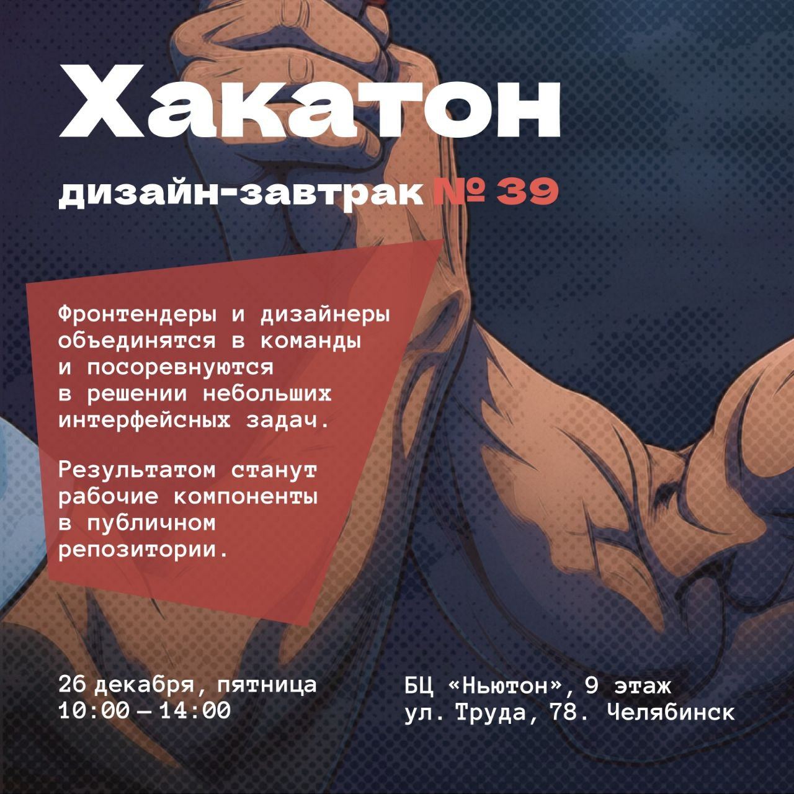

# frontenders-and-designers-work-together

Шаблон репозитория для фронтово-дизайнерского хакатона в Челябинске.



## Описание задачи

В данном проекте реализуется задача по разработке карточки товара с функционалом выбора количества и срока годности. Дизайн задачи доступен в Figma:

[Задача 1 - Карточка товара](https://www.figma.com/design/DCnjbb9XrVM1LWBZYorXhO/%D0%97%D0%B0%D0%B4%D0%B0%D1%87%D0%B0-1%D0%B8?node-id=7001-40&t=ERs2q5S1e0tRicPG-0)

## Разработка

```bash
# Установка зависимостей
npm install

# Запуск dev-сервера
npm run dev

# Запуск Storybook
npm run storybook

# Сборка проекта
npm run build
```

## Тестирование

Проект использует два подхода к тестированию:

### Unit-тесты (Vitest)

[Vitest](https://vitest.dev/) используется для быстрых unit-тестов, которые выполняются в Node.js окружении.

```bash
# Запуск всех unit-тестов
npm test

# Запуск тестов в watch-режиме (автоматический перезапуск при изменении файлов)
npm test

# Запуск тестов один раз (для CI/CD)
npm test -- --run

# Запуск тестов с UI интерфейсом
npm run test:ui

# Запуск тестов с отчетом о покрытии кода
npm run test:coverage
```

### Browser-тесты (Playwright)

[Playwright](https://playwright.dev/) используется для тестирования компонентов в реальном браузере. Эти тесты позволяют видеть, как компоненты работают в браузере, и взаимодействовать с ними визуально.

```bash
# Запуск browser-тестов (headless режим)
npm run test:ct

# Запуск browser-тестов с UI интерфейсом (рекомендуется для разработки)
npm run test:ct:ui

# Запуск browser-тестов в видимом браузере (headed режим)
npm run test:ct:headed
```

**Рекомендация:** Используйте `npm run test:ct:ui` для разработки - это откроет интерактивный интерфейс Playwright, где вы сможете:
- Видеть все тесты в реальном времени
- Наблюдать, как тесты выполняются в браузере
- Делать скриншоты и просматривать их
- Отлаживать падающие тесты
- Видеть трассировку выполнения тестов

### Структура тестов

**Unit-тесты** (Vitest) находятся рядом с компонентами и имеют расширение `.test.tsx` или `.test.ts`:
- `src/components/quantity-input/QuantityInput.test.tsx` - unit-тесты для компонента QuantityInput
- `src/components/date-picker/DatePicker.test.tsx` - unit-тесты для компонента DatePicker
- `src/test/setup.ts` - настройки тестового окружения

**Browser-тесты** (Playwright) находятся рядом с компонентами и имеют расширение `.spec.tsx`:
- `src/components/quantity-input/QuantityInput.spec.tsx` - browser-тесты для компонента QuantityInput
- `src/components/date-picker/DatePicker.spec.tsx` - browser-тесты для компонента DatePicker

### Запуск тестов в CI/CD

Тесты автоматически запускаются в GitHub Actions при каждом push в ветки `main`, `master` или `develop`. Если тесты падают, деплой не выполняется.

## Деплой на GitHub Pages

Проект автоматически деплоится на GitHub Pages при пуше в ветки `main`, `master` или `develop`.

### Настройка GitHub Pages

1. Перейдите в настройки репозитория: **Settings** → **Pages**
2. В разделе **Source** выберите:
   - **Source**: `Deploy from a branch`
   - **Branch**: `gh-pages` (будет создана автоматически) или выберите другую ветку
   - **Folder**: `/ (root)`
3. Сохраните изменения

После первого деплоя проект будет доступен по адресу:
`https://matperez.github.io/byndyusoft-mnms/`

### Ручной запуск деплоя

В разделе **Actions** → **Deploy to GitHub Pages** можно запустить деплой вручную через кнопку **Run workflow**.
